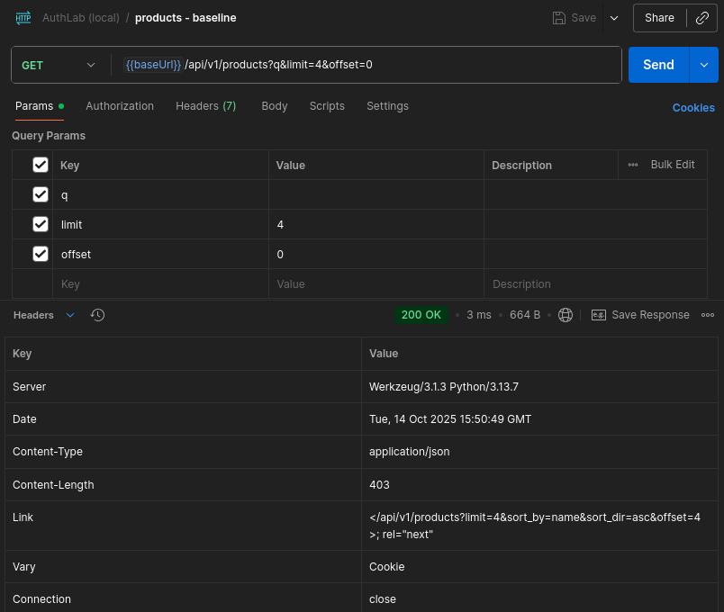
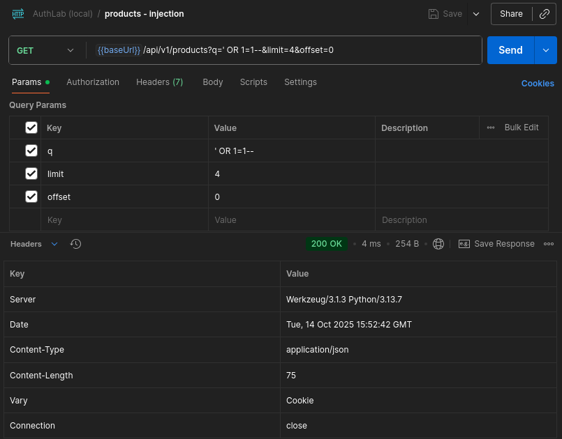

# API SQLi Negative - `/api/v1/products` (Verify)

* **Status:** Adopted  
* **Security impact:** (verification only)  
* **Route:** `/api/v1/products` (GET)  
* **Parameter:** `q`  
* **Environment:** Local lab (session cookie via Dev API Key)  

---

## 1) Summary

This note verifies the **absence of SQL Injection** in the **API** search endpoint.  
The `q` parameter is bound via **DB-API placeholders (`?`)**, so classic tautology payloads (for example `' OR 1=1--`) are treated as **data**, not SQL syntax.

**Pass condition:** `total(injection)` is **not greater** than `total(baseline)`.

---

## 2) Scope & Preconditions

* **Lab:** running locally as per [SETUP.md](../../../setup/SETUP.md) (DB seeded, app in DEV mode).  
* **Client/tool:** Postman Desktop.
* **Affected endpoint:** `GET /api/v1/products?q=<term>&limit=<N>&offset=<M>`. 
* **Auth (lab-only):** Dev API Key - session cookie.  
  *Procedure:* call `GET /api/v1/auth/session` with `Authorization: Bearer {{devApiKey}}`, then reuse the cookie.  
* **Table:** `products(id INTEGER PRIMARY KEY, name TEXT, price REAL)`.  

---

## 3) Test Procedure

* **A) Baseline** - Params: `q` empty, `limit=4`, `offset=0` - record `total` as **T0**.  
* **B) Injection** - Params: `q = ' OR 1=1--` - record `total` as **Ti**.  

**Assertion:** verify that **Ti ≤ T0**.

---

## 4) Evidence

### Baseline

**Screenshot:**

  

*Baseline*

**Body - `baseline.json` (concise excerpt):**

```json
{
  "count": 4,
  "items": [
    {
      "id": 18,
      "name": "Keyboard Mech",
      "price": 89.0
    },
    {
      "id": 2,
      "name": "Laptop Air 13",
      "price": 999.0
    }
    /* ... */
  ],
  "limit": 4,
  "offset": 0,
  "total": 18
}
```

**Artifact:** [baseline.json](baseline.json)

---

### Injection

**Screenshot:**


*Injection*

**Body — `injection.json`:**

```json
{
  "count": 0,
  "items": [],
  "limit": 4,
  "offset": 0,
  "total": 0
}
```

**Artifact:** [injection.json](injection.json)

---

## 5) Logs (concise excerpt)

```json
[{"result": "api_products", "reason": "list", "route": "/api/v1/products",
"meta": {"q": "", "min": null, "max": null, "sort": "name:asc", "limit": 4, "offset": 0, "count": 4, "total": 18}},

{"result": "api_products", "reason": "list", "route": "/api/v1/products",
"meta": {"q": "' OR 1=1--", "min": null, "max": null, "sort": "name:asc", "limit": 4, "offset": 0, "count": 0, "total": 0}}]
```

---

### 5.5) Full log from `logs/authlab.log`

**Full log:** [full_log.jsonl](full_log.jsonl)

---

## 6) Result

* Observed: `T0 = 18`, `Ti = 0`.
* Assertion: `Ti ≤ T0` - **PASS** (tautology payload treated as data due to parameter binding).


