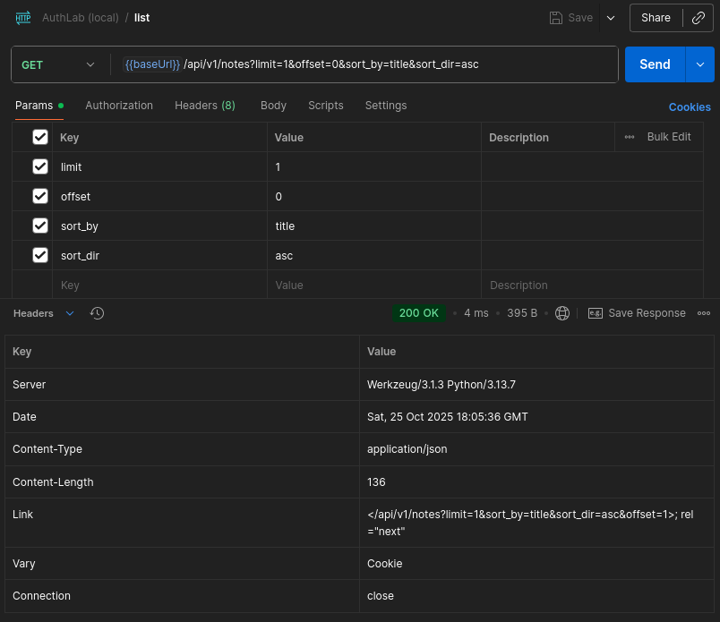
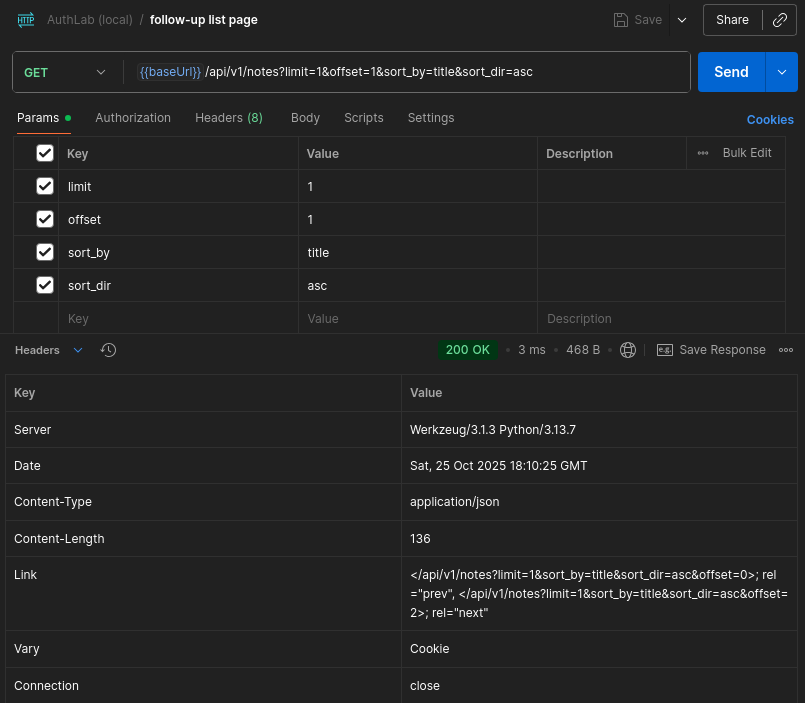
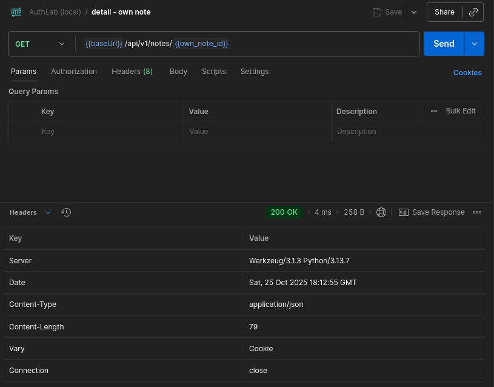
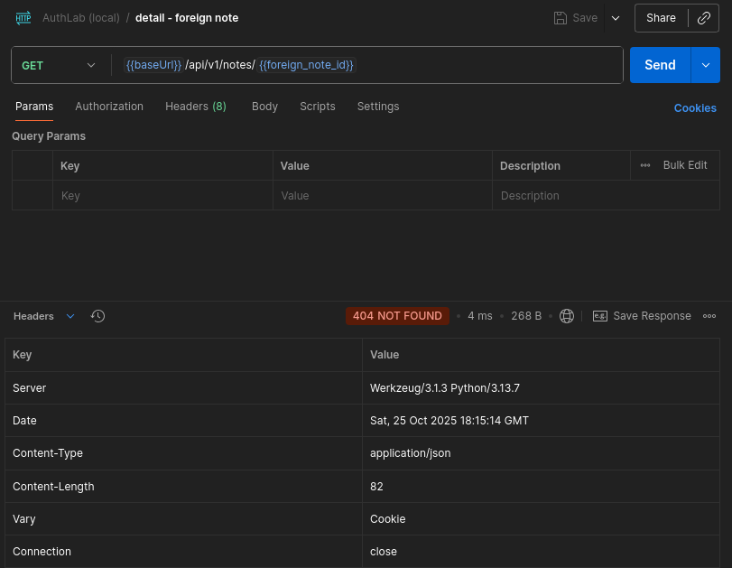
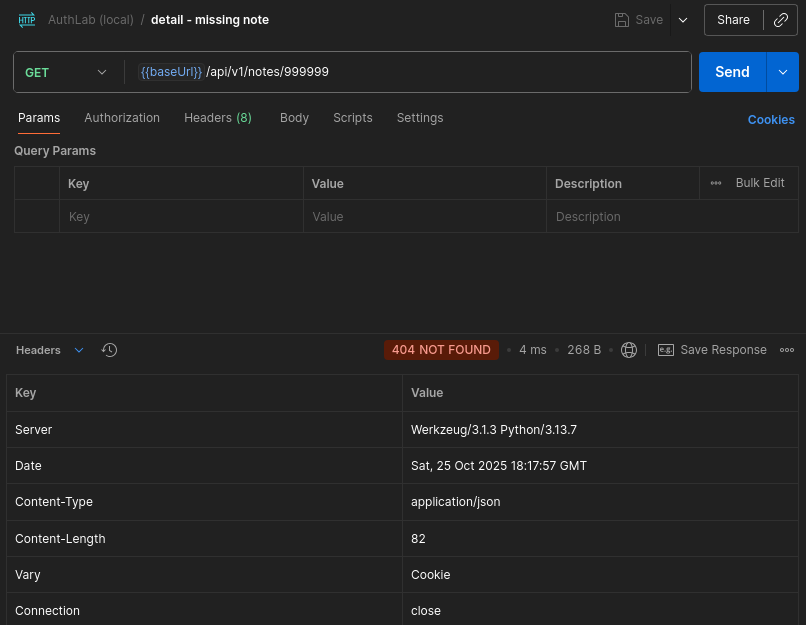

# Notes API - Owner-Only List & Detail with JSON-404 Masking

* **Status:** Adopted  
* **Security impact:** Prevents IDOR in API; consistent 404 masking  
* **Routes:** `/api/v1/notes` (list), `/api/v1/notes/{id}` (detail)  
* **Area:** Authorization & API ergonomics  
* **Environment:** Local lab (session cookie via Dev API Key)  

---

## 1) Summary

This report documents the **Notes API** behaviour:

1. `GET /api/v1/notes` returns **only the current user’s notes** with offset-based pagination and optional `Link` headers (`rel="prev"`, `rel="next"`).
2. `GET /api/v1/notes/{id}` enforces an **owner check** and returns the same **JSON-404** for both non-existent and foreign notes (enumeration-safe, no IDOR).

---

## 2) Scope & Preconditions

* **Lab:** running locally as per [SETUP.md](../../../setup/SETUP.md) (DB seeded, app in DEV mode).  
* **Client/tool:** Postman Desktop.
* **Affected endpoints:**
  * `GET /api/v1/notes?limit=<N>&offset=<M>&sort_by=<id|title>&sort_dir=<asc|desc>`
  * `GET /api/v1/notes/{id}`.  
* **Auth (lab-only):** Dev API Key - session cookie.  
  *Procedure:* call `GET /api/v1/auth/session` with `Authorization: Bearer {{devApiKey}}`, then reuse the cookie.
* **Table:** `notes(id INTEGER PRIMARY KEY, title TEXT, body TEXT, owner TEXT)`.  

---

## 3) Implementation

* **Owner filtering (List):**
  server uses `owner = user.lower()` and `WHERE owner = ?` - **no** `owner` query param is accepted.
* **Sorting (whitelist only):**
  `sort_by` `{id, title}`, `sort_dir` `{asc, desc}`, secondary `id` stabilises order.
* **Pagination (List):**
  `limit` (1-100) and `offset` (0-10000); JSON response includes `items`, `count`, `total`, `offset`, `limit`.
* **RFC 5988 `Link` header (List):**
  * add `rel="next"` if `offset + limit < total`;
  * add `rel="prev"` if `offset > 0`;
  * **Preserved query params in URLs:** `limit`, `sort_by`, `sort_dir`.
* **Detail masking:**
  select by **both** `id` and `owner`; foreign or missing notes return the same JSON-404 (`code: "not_found"`)
* **Payload shape:**
  * List items - `{ "id": <int>, "title": <str> }`
  * Detail - `{ "id": <int>, "title": <str>, "body": <str> }`

---

## 4) Verification (Postman)

### A) List - own only, with pagination links

Request:
`GET {{baseUrl}}/api/v1/notes?limit=1&offset=0&sort_by=title&sort_dir=asc`

**Screenshot:**



*First list page - only own notes*

**Body - `list_p1.json`:**

```json
{
  "count": 1,
  "items": [
    {
      "id": 1,
      "title": "Admin note #1"
    }
  ],
  "limit": 1,
  "offset": 0,
  "total": 3
}
```

**Artifact: [list_p1.json](list_p1.json)**

### Follow-up page:

Request:
`GET {{baseUrl}}/api/v1/notes?limit=1&offset=1&sort_by=title&sort_dir=asc`

**Screenshot:**



*Follow-up page - next own note*

**Body - `list_p2.json`:**

```json
{
  "count": 1,
  "items": [
    {
      "id": 2,
      "title": "Admin note #2"
    }
  ],
  "limit": 1,
  "offset": 1,
  "total": 3
}
```

**Artifact: [list_p2.json](list_p2.json)**

### B) Detail - own note (OK)

Request:
`GET {{baseUrl}}/api/v1/notes/1`

**Screenshot:**



*Detail - own note*

**Body - `detail_own.json`:**

```json
{
  "body": "Seeded note 1 for admin",
  "id": 1,
  "title": "Admin note #1"
}
```

**Artifact: [detail_own.json](detail_own.json)**

### C) Detail - foreign note (masked)

Request:
`GET {{baseUrl}}/api/v1/notes/4` (admin trying Alice’s note):

**Screenshot:**



*Detail - foreign note - masked 404*

Body - `detail_foreign.json`:

```json
{
  "error": {
    "code": "not_found",
    "message": "Resource not found"
  }
}
```

**Artifact: [detail_foreign.json](detail_foreign.json)**

---

### D) Detail - missing note (masked)

Request:
`GET {{baseUrl}}/api/v1/notes/999999`

**Screenshot:**



*Detail - missing note - same masked 404*

**Body - `detail_missing.json`:**

```json
{
  "error": {
    "code": "not_found",
    "message": "Resource not found"
  }
}
```

**Artifact: [detail_missing.json](detail_missing.json)**

---

## 5) Logs (concise excerpt)

```json
[
  {"result": "api_notes", "reason": "list", "route": "/api/v1/notes", "meta": {"user": "admin", "sort": "title:asc", "limit": 1, "offset": 0, "count": 1, "total": 3}},
  {"result": "api_notes", "reason": "detail_ok", "route": "/api/v1/notes/1", "meta": {"note_id": 1}},
  {"result": "api_notes", "reason": "detail_masked_404", "route": "/api/v1/notes/4", "meta": {"note_id": 4}},
  {"result": "api_notes", "reason": "detail_masked_404", "route": "/api/v1/notes/999999", "meta": {"note_id": 999999}}
]
```

### 5.5) Full log from `logs/authlab.log`

**Full log: [full_log.jsonl](full_log.jsonl)**

---

## 6) Result

* **List** returns only the caller’s notes; pagination works and `Link` headers are present when applicable.
* **Detail** returns `200` for own notes and the same JSON-404 for both foreign and missing notes - no IDOR.
* **Owner** is never exposed in API responses; ownership is enforced server-side via `owner = user.lower()` and `WHERE owner = ?`.
