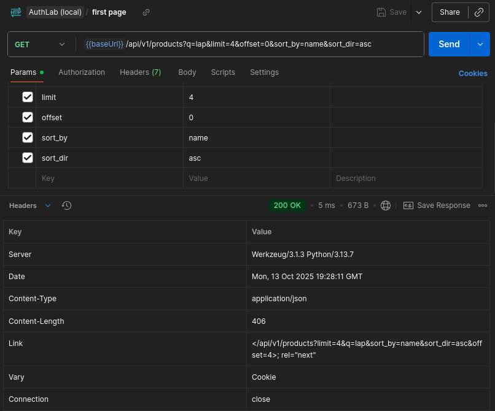
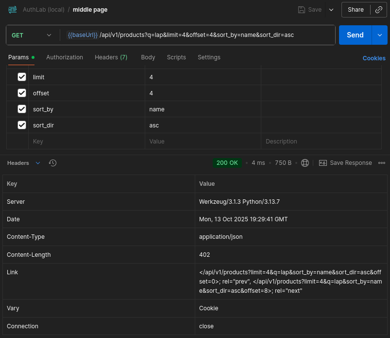

# Case-Insensitive Product Search + Name Index (SQLite) & Link Pagination (RFC 5988)

* **Status:** Adopted  
* **Security impact:** (functional/performance only)  
* **Route:** `/api/v1/products` (GET)  
* **Area:** Search & Pagination  
* **Environment:** Local lab (session cookie via Dev API Key)  

---

## 1) Summary

This note documents two API improvements for `/api/v1/products`:

1. Case-insensitive search on products(name) using `COLLATE NOCASE`, plus a dedicated index `idx_products_name_nocase`.
The index can serve prefix patterns like 'Lap%' (see EXPLAIN below); generic substring patterns such as `%lap%` still fall back to a table scan.
2. RFC 5988 `Link` headers (`rel="next"`, `rel="prev"`) so clients can navigate pages without recomputing offsets.

---

## 2) Scope & Preconditions

* **Lab:** running locally as per [SETUP.md](../../../setup/SETUP.md) (DB seeded, app in DEV mode).  
* **Client/tool:** Postman Desktop.
* **Affected endpoint:**  
  `GET /api/v1/products?q=<term>&min_price=<min>&max_price=<max>&limit=<N>&offset=<M>&sort_by=<id|name|price>&sort_dir=<asc|desc>`.
* **Auth (lab-only):** Dev API Key - session cookie.  
  *Procedure:* call `GET /api/v1/auth/session` with `Authorization: Bearer {{devApiKey}}`, then reuse the cookie.  
* **Table:** `products(id INTEGER PRIMARY KEY, name TEXT, price REAL)`.  
* **DB note:** [db_init.py](../../../../scripts/db_init.py) creates tables and seed data, then applies the NOCASE index from [001_products_nocase_index.sql](../../../../scripts/001_products_nocase_index.sql) (required for the index vs scan EXPLAIN examples below).


---

## 3) Implementation

* Filter (parameterised):  
  `WHERE name LIKE ? COLLATE NOCASE`   (pattern is built as "%{q}%")
  plus optional `price >= ?` / `price <= ?` when `min_price` / `max_price` are provided.
* **Sorting (whitelist only):**  
  `id | name | price` × `asc | desc`, with a secondary `id` to stabilise order.
* **Pagination links (RFC 5988):**  
  Response includes `Link:` headers:
  * add `rel="next"` if `offset + limit < total`;
  * add `rel="prev"` if `offset > 0`;
  * preserve validated filters in generated URLs: `q`, `min_price`, `max_price`, `sort_by`, `sort_dir`, `limit`.

---

## 4) Verification (CLI - EXPLAIN QUERY PLAN)

Goal: show the plan difference (index vs scan).

### A) Prefix search - index is used

Command:

```bash
sqlite3 authlab.db \
  "EXPLAIN QUERY PLAN
   SELECT id, name, price
   FROM products
   WHERE name LIKE 'Lap%' COLLATE NOCASE;"
````

Expected shape:

```text
QUERY PLAN
`--SEARCH products USING INDEX idx_products_name_nocase (name>? AND name<?)
```

### B) Leading-percent - expect a scan

Command:

```bash
sqlite3 authlab.db \
  "EXPLAIN QUERY PLAN
   SELECT id, name, price
   FROM products
   WHERE name LIKE '%lap%' COLLATE NOCASE;"
```

Expected:

```bash
QUERY PLAN
`--SCAN products
```

---

## 5) Pagination links (RFC 5988) - Evidence (Postman)

### Case 1 - first page (has next, no prev)

Request:
`GET {{baseUrl}}/api/v1/products?q=lap&limit=4&offset=0&sort_by=name&sort_dir=asc`

**Screenshot:**



*First page request and headers*

**Body - `first_page.json` (concise excerpt):**

```json
{
  "count": 4,
  "items": [
    { "id": 2,  "name": "Laptop Air 13",  "price": 999.0 },
    { "id": 12, "name": "Laptop Edge 14", "price": 1149.0 }
    /* ... */
  ],
  "limit": 4,
  "offset": 0,
  "total": 12
}
```

**Artifact: [first_page.json](first_page.json)**

---

### Case 2 - middle page (has both prev and next)

Request:
`GET {{baseUrl}}/api/v1/products?q=lap&limit=4&offset=4&sort_by=name&sort_dir=asc`

**Screenshot:**



*Middle page request and headers*

**Body - `middle_page.json` (concise excerpt):**

```json
{
  "count": 4,
  "items": [
    { "id": 7, "name": "Laptop Gamer 15", "price": 1499.0 },
    { "id": 1, "name": "Laptop Go 12",    "price": 799.0 }
    /* ... */
  ],
  "limit": 4,
  "offset": 4,
  "total": 12
}
```

**Artifact: [middle_page.json](middle_page.json)**

---

## 6) Logs (concise excerpt)

```json
[
  {"result": "api_products", "reason": "list", "route": "/api/v1/products",
  "meta": {"q": "lap", "min": null, "max": null, "sort": "name:asc", "limit": 4, "offset": 0, "count": 4, "total": 12}},
  
  {"result": "api_products", "reason": "list", "route": "/api/v1/products",
  "meta": {"q": "lap", "min": null, "max": null, "sort": "name:asc", "limit": 4, "offset": 4, "count": 4, "total": 12}}
]
```

### 6.5) Full log from `logs/authlab.log`

**Full log:** [full_log.jsonl](full_log.jsonl)

---

## 7) Result

* Prefix lookups (`LIKE 'Lap%' COLLATE NOCASE`) use `SEARCH products USING INDEX idx_products_name_nocase`.
* Leading-percent lookups (`LIKE '%lap%' COLLATE NOCASE`) fall back to a table scan, as expected.
* API responses expose consistent RFC 5988 `Link` headers for `prev` / `next`, with filters preserved in URLs.
