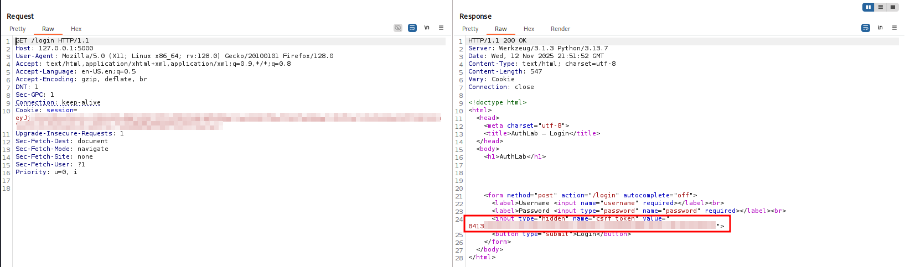
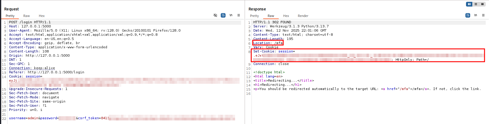
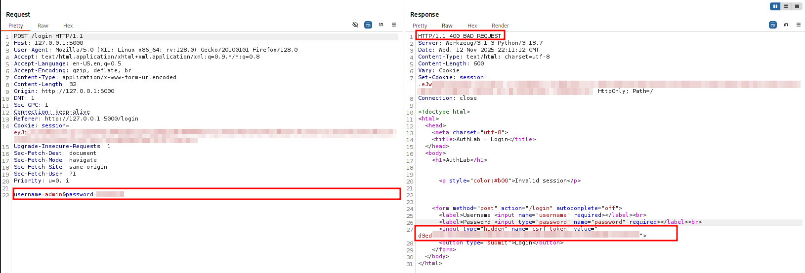
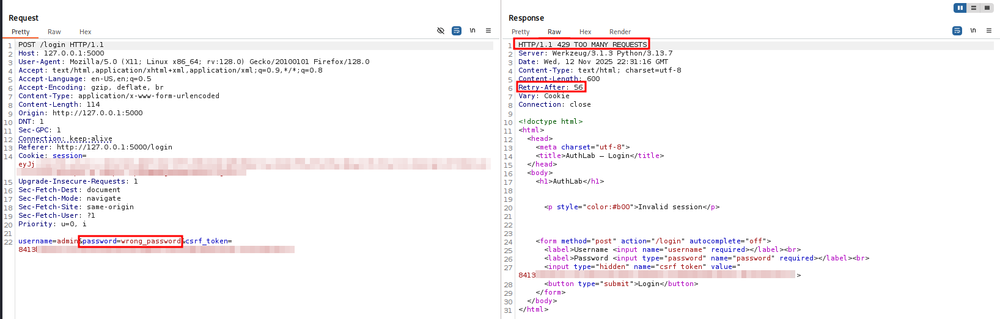
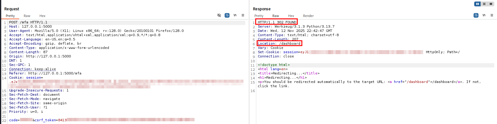
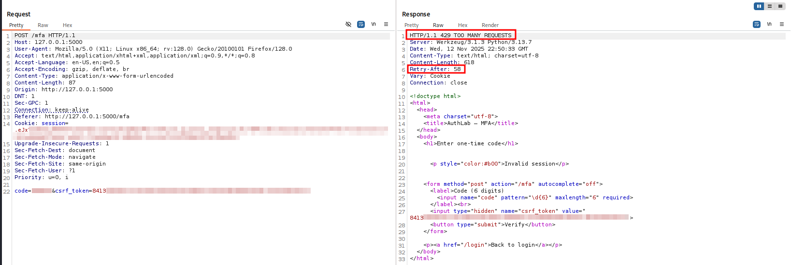
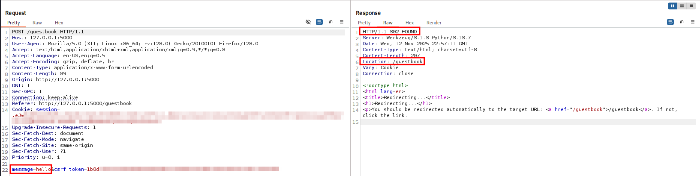
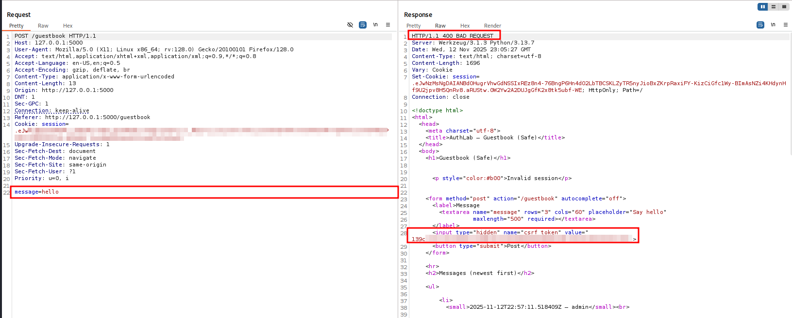
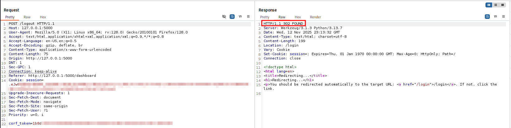
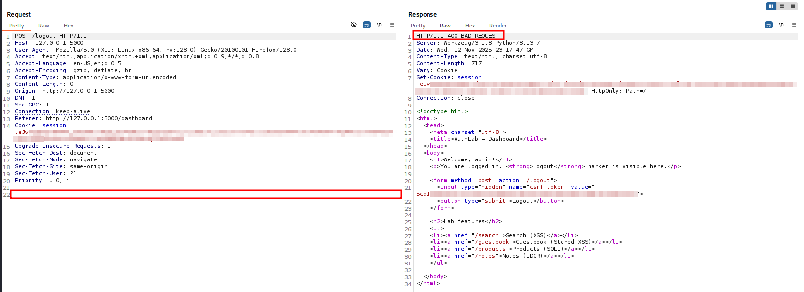

# Web Auth - Sessions, CSRF, Rate-Limit, MFA (HTML)

* **Status:** Adopted  
* **Security impact:** High (defense-in-depth)  
* **Routes:** `/login` (GET, POST), `/mfa` (GET, POST), `/guestbook` (POST), `/logout` (POST)  
* **Area:** Web authentication & sessions (HTML branch)  
* **Environment:** Local lab (browser, Flask session cookie)  

---

## 1) Summary

This note documents the **current secure model** for the HTML authentication flow:

1. **Cookie session:** After successful login the server sets an **HttpOnly** session cookie.
2. **CSRF for all state-changing actions:** A hidden `csrf_token` field is present on `login`, `mfa`, `guestbook` and `logout` forms; the server compares it against `session["csrf_token"]`.
3. **Brute-force throttling (fixed window):** Login and MFA are protected with a rate-limit (`WINDOW_SEC × MAX_ATTEMPTS`). When exceeded, the server returns **429** and a **Retry-After** header.
4. **Optional MFA (TOTP):** When enabled, an additional one-time code is required after the password, with a small time window tolerance (`MFA_WINDOW`).
5. **Unified logging:** All outcomes (success, bad password, CSRF error, rate-limit, MFA ok/fail) are written to `logs/authlab.log` with minimal context.

---

## 2) Scope & Preconditions

* **Lab:** running locally as per [SETUP.md](../../setup/SETUP.md) (DB seeded, app in DEV mode).
* **Client:** Firefox 128.14.0esr, inspected via **DevTools - Network / Storage or Burp Suite app**.
* **Account:** admin user; password is defined by `ADMIN_PWHASH` in `.env`.
* **MFA:** controlled by environment (`ADMIN_MFA_ENABLED`). When disabled, login goes straight from password to session.

---

## 3) Implementation

### 3.1 Login - password - session

**GET `/login`**

* Renders the login form with a hidden `csrf_token`:
  * if no CSRF is present in the session, a new token is generated;
  * token is stored both in `session["csrf_token"]` and in the hidden field.

**POST `/login`**

1. **CSRF check first**  
   If the form token is missing or does not match `session["csrf_token"]`, the request is rejected, a new token is issued and the login form is re-rendered with an error.
2. **Rate-limit**  
   A fixed-window counter keyed by `ip|username` is incremented. If the number of attempts within `WINDOW_SEC` exceeds `MAX_ATTEMPTS`, the server returns `429 Too Many Requests` and `Retry-After: <seconds>`.
3. **Password verification**  
   The submitted password is compared against `ADMIN_PWHASH`.
4. **MFA decision**
   * If MFA is **enabled**, the server stores a temporary `pending_user` in session and redirects to `/mfa`.
   * If MFA is **disabled**, the server creates a full session (`session["user"] = "admin"`) and redirects to the dashboard.

**Session cookie**

* The cookie is issued via `Set-Cookie: session=…; HttpOnly; Path=/`.
* For a production system we would additionally enable `Secure` and an appropriate `SameSite` attribute. (out of scope)

### 3.2 MFA (when enabled)

**GET `/mfa`**

* Renders a form with:
  * an input for the 6-digit code (`pattern="\d{6}"`, `maxlength="6"`),
  * a hidden `csrf_token` (same mechanism as `/login`).

**POST `/mfa`**

1. Validates **CSRF** as above.
2. Applies **MFA rate-limit** with its own fixed window (same idea as login).
3. Verifies the TOTP code against `ADMIN_MFA_SECRET`, allowing a small time window (`MFA_WINDOW`) for clock skew.
4. On success:
   * promotes `pending_user` to `session["user"]`,
   * clears temporary state,
   * redirects to `/dashboard`.

On repeated failures or when the window is exceeded, the response is either `401 Unauthorized` (wrong code) or `429 Too Many Requests` with `Retry-After`.

### 3.3 Guestbook (HTML POST)

**POST `/guestbook`**

* Requires a valid CSRF token; otherwise returns `400 Bad Request` and re-renders the form with a new token.
* Trims the message to `MAX_MSG_LEN` characters.
* Uses the **Post/Redirect/Get (PRG)** pattern:
  * on success returns `302` with `Location: /guestbook`,
  * the browser then performs a GET to display the updated list.

### 3.4 Logout

**POST `/logout`**

* Requires a valid CSRF token.
* On success:
  * clears the session (`session.clear()`),
  * responds with `302` and `Location: /login` (session cookie is invalidated).
* On missing or invalid CSRF, returns `400 Bad Request` and issues a fresh token in the form.


## 4) Verification (Burp Suite Evidence)

All checks were performed via Burp Suite (Proxy - HTTP history / Repeater).

### A) Login form - CSRF present

Request:
`GET /login`  



*Login page response with hidden `csrf_token` and initial session cookie.*

### B) Login success - cookie session + redirect to MFA

Request:
`POST /login` with valid credentials and correct `csrf_token`  


 
*Successful login: request shows username + CSRF, response sets session cookie and redirects to `/mfa`.*

### C) Login CSRF negative

Request:
 `POST /login` without `csrf_token` or with a modified value  



*Login rejected due to bad CSRF; form is re-rendered with a fresh token.*


### D) Login rate-limit

Request:
send several login attempts with wrong password within the same window  



*Multiple invalid passwords trigger fixed-window throttling with `Retry-After`.*


### E) MFA success

Request:
`POST /mfa` with a valid TOTP code and correct CSRF.  


  
*Valid code upgrades the session and redirects to the dashboard.*

### F) MFA negative (wrong code / rate-limit)

Request:
`POST /mfa` with an invalid code (and correct CSRF), repeated until throttled.  


 
*Example of MFA throttling with `Retry-After` header.*

### G) Guestbook POST - PRG with CSRF

Request:
`POST /guestbook` with a message and valid CSRF


  
*State-changing POST uses PRG and redirects back to `/guestbook`.*

### H) Guestbook POST - CSRF negative

Request:
`POST /guestbook` without `csrf_token`.  



*Guestbook POST is rejected without CSRF; new token is issued.*

### I) Logout with CSRF

Request:
`POST /logout` with a valid CSRF token.  


  
*Logout clears the session and redirects to the login page.*

### J) Logout CSRF negative

Request:
`POST /logout` without the hidden CSRF field.  


  
*Logout request without CSRF is rejected; a fresh token is returned in the form.*

---

## 5) Logs (concise excerpts)

```json
[
  {"result": "mfa_required", "reason": "-", "route": "/login"},
  {"result": "invalid", "reason": "csrf_bad", "route": "/login"},
  {"result": "invalid", "reason": "bad_password", "route": "/login"},
  {"result": "invalid", "reason": "rate_limited", "route": "/login"},

  {"result": "success", "reason": "mfa_ok", "route": "/mfa"},
  {"result": "invalid", "reason": "mfa_bad", "route": "/mfa"},
  {"result": "invalid", "reason": "rate_limited", "route": "/mfa"},

  {"result": "xss_surface", "reason": "stored_safe", "route": "/guestbook"},
  {"result": "invalid", "reason": "csrf_bad", "route": "/guestbook"},

  {"result": "logout", "reason": "ok", "route": "/logout"},
  {"result": "invalid", "reason": "csrf_bad", "route": "/logout"}
]

```

### 5.5) Full log from `logs/authlab.log`

**Full log:** [full_log.jsonl](full_log.jsonl)
