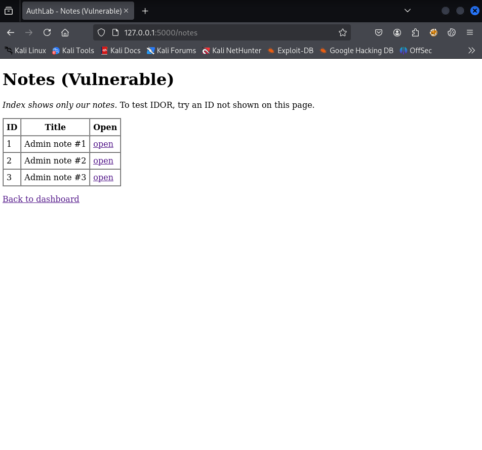
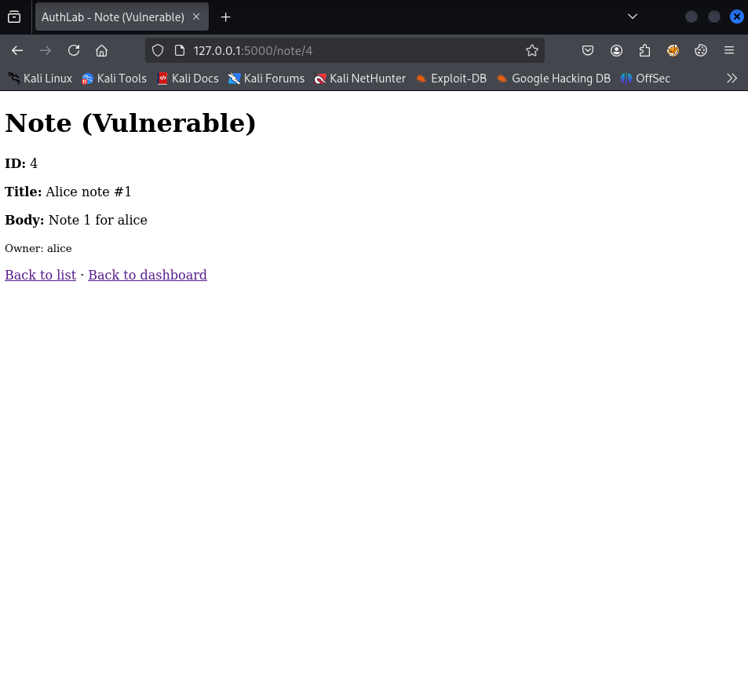
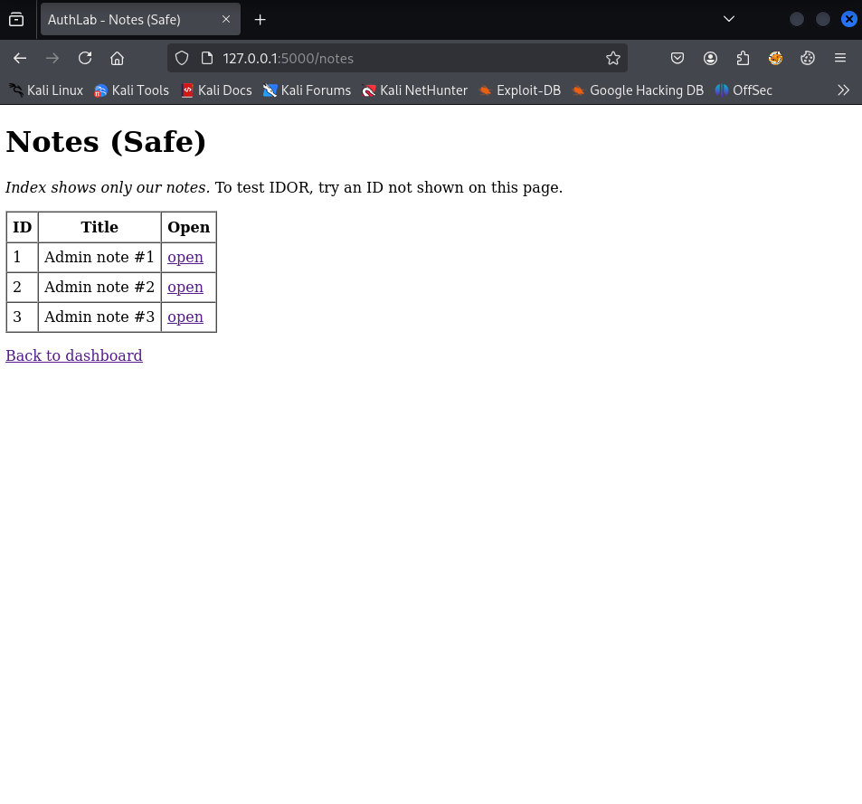
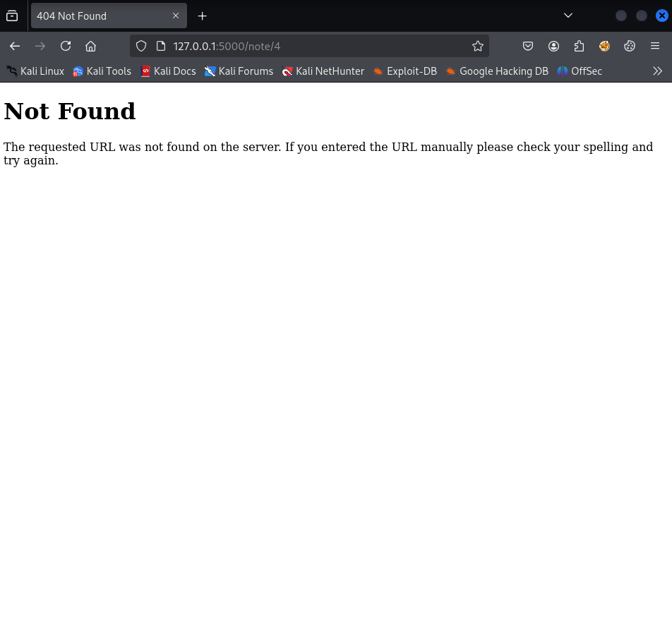

# IDOR - `/note/<note_id>` (+ `/notes`) - (PoC → Fix → Verify)

* **Status:** Fixed  
* **Severity:** High  
* **Routes:** `/notes` (index), `/note/<note_id>` (detail)  
* **Environment:** Local lab (authenticated as `admin`)  
* **Toggle:** `IDOR_STATE` env var (`poc` = vulnerable branch, `safe` = fixed branch)

---

## 1) Summary

The notes feature returned note content based only on the numeric `note_id` and did not verify that the current session user is the owner of the note. This is **Insecure Direct Object Reference (IDOR)**.

**Impact:** a logged-in user can retrieve other users’ notes by guessing or enumerating IDs, causing privacy breaches and potential exposure of secrets/PII/credentials.

---

## 2) Scope & Preconditions

* **Lab:** running locally as per [SETUP.md](../../../setup/SETUP.md) (DB seeded, app in DEV mode).
* **Client:** browser (Firefox 128.14.0esr), local Flask dev server.  
* **Affected endpoints:**
  * `/notes` - index page listing the current user’s notes.
  * `/note/<note_id>` - detail page loading a note by `id`.
* **Reachability:** after login via `/dashboard` - link `Notes (IDOR)` 
* **Table:** `notes(id INTEGER PRIMARY KEY, title TEXT, body TEXT, owner TEXT)`.  
* **To reproduce PoC:** set `IDOR_STATE=poc` in environment and restart the server.

The index (`/notes`) always lists only the current user’s notes in both modes. The vulnerability is intentionally concentrated in the detail endpoint to demonstrate that UI hiding is not authorization.

---

## 3) Data Flow (Before)

**Source:** path parameter `note_id`  
**Sink:** template rendering of the note page

1. Browser requests `GET /note/<id>`.  
2. Server fetches the row by `id`.  
3. **Vulnerable path:** server renders the note without verifying `note.owner == session["user"]`.

---

## 4) Vulnerable Implementation (Before)

**Handler fragment from [idor_html.py](../../../../authlab/web/idor_html.py):**

```python
cur.execute(
            "SELECT id, title, body, owner FROM notes WHERE id = ?",
            (note_id,),
        )
        note = cur.fetchone()

    if core.IDOR_STATE == "poc":
        reason = "no_owner_check"
        if not note:
            abort(404)
        core.log_attempt(
            user,
            True,
            "idor_surface",
            reason,
            route=request.path,
            meta={"note_id": note_id, "owner": note["owner"]},
        )
        return render_template("note.html", note=note, state=core.IDOR_STATE)
```

Anyone who is logged in can open arbitrary `/note/<id>` and see its contents if it exists, regardless of ownership.

---

## 5) Proof of Concept (Before Fix)

**Precondition:** `IDOR_STATE=poc` (restart server).

**Steps (as `admin`):**

1. Open `/notes`. The page lists only our notes (no foreign links in UI).

   **Screenshot:**

   

   *Only own notes shown.*

2. Manually request another user’s note by guessing the ID:

   ```
   /note/4
   ```

   **Observed:** The page renders a note owned by a different user (`alice`). Ownership is not checked.

   **Screenshot:**

   

   *Foreign note visible via direct ID.*

**Log evidence (concise excerpt):**

```json
{"result": "idor_surface", "reason": "no_owner_check", "route": "/note/4", "meta": {"note_id": 4, "owner": "alice"}}
```

---

## 6) Fix (What Changed & Why)
 
**Detail handler fragment from [idor_html.py](../../../../authlab/web/idor_html.py):**

Server-side authorization check in the detail handler (+ 404 masking):

```python
cur.execute(
            "SELECT id, title, body, owner FROM notes WHERE id = ?",
            (note_id,),
        )
        note = cur.fetchone()

if not note or note["owner"] != user:
        reason = "blocked_404"
        core.log_attempt(
            user,
            True,
            "idor_surface",
            reason,
            route=request.path,
            meta={"note_id": note_id},
        )
        abort(404)

    reason = "owner_enforced"
    core.log_attempt(
        user,
        True,
        "idor_surface",
        reason,
        route=request.path,
        meta={"note_id": note_id, "owner": note["owner"] if note else None},
    )
    return render_template("note.html", note=note, state=core.IDOR_STATE)

```

**Why this works:** Even if a user guesses a valid `note_id`, access is denied unless the session user is the owner. Returning `404` (instead of `403`) avoids confirming that the object exists, reducing enumeration value.

**Security principle:** Server-side authorization for every direct object reference. Hiding links in UI is insufficient.

---

## 7) Verification (After Fix)

**Precondition:** `IDOR_STATE=safe` (restart server).

**Steps (as `admin`):**

1. Open our own note:

   ```
   /note/1
   ```

   **Expected:** note renders (owner enforced).

2. Try another user’s note:

   ```
   /note/4
   ```

   **Expected:** `404 Not Found` (no content leak).

**Screenshots:**



*Own note visible.*



*Foreign note blocked with 404.*

**Log evidence (safe branch - concise excerpt):**

```json
{"result": "idor_surface", "reason": "blocked_404",
 "route": "/note/4", "meta": {"note_id": 4}}
```

---

### 7.5) Full log from `logs/authlab.log`

**Full log:** [full_log.jsonl](full_log.jsonl)

---

## 8) Lab Toggle Rationale (non-production)

For demonstration, the lab exposes a single environment variable (`IDOR_STATE`) that toggles behaviour:

* `poc`: no owner check (vulnerable).
* `safe`: owner check + 404 masking (fixed).