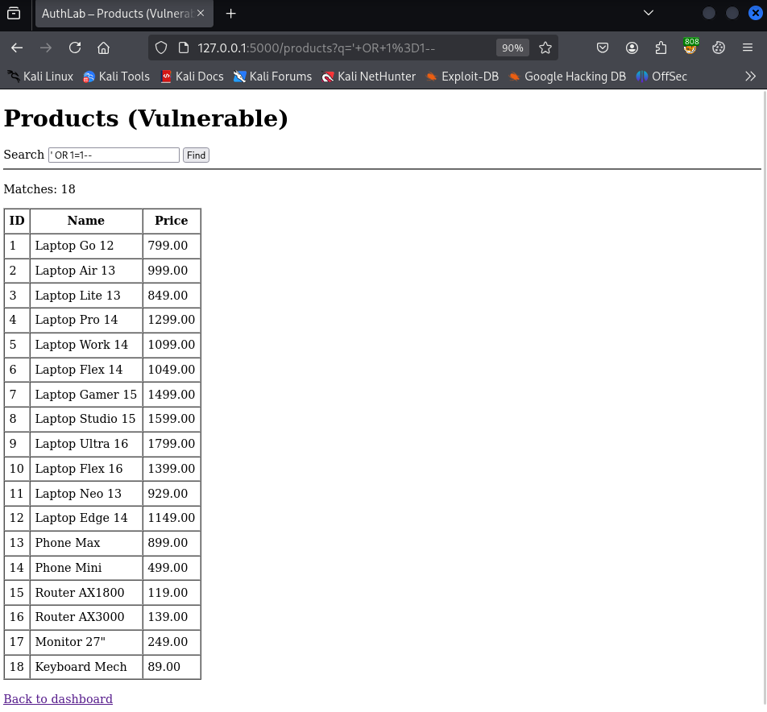
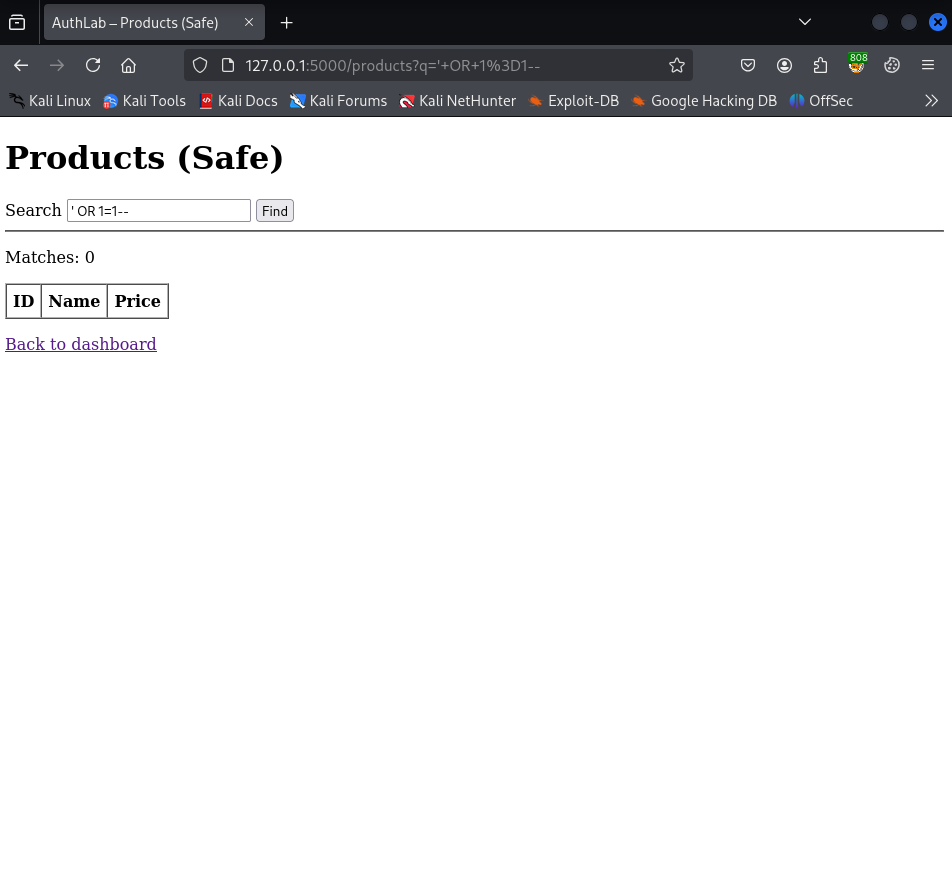

# SQL Injection - `/products` (PoC → Fix → Verify)

* **Status:** Fixed  
* **Severity:** High  
* **Route:** `/products` (GET)  
* **Parameter:** `q`  
* **Environment:** Local lab (authenticated as `admin`)  
* **Toggle:** `SQLI_STATE` env var (`poc` = vulnerable branch, `safe` = fixed branch)

---

## 1) Summary

The `q` search parameter was **directly concatenated** into a SQL query string in the `/products` route.  
This enabled **SQL Injection** – manipulating the query to return unintended results.

**Impact:** bypass application logic (return all rows via tautologies), enumerate data, potential pivot to data exfiltration on richer schemas.

---

## 2) Scope & Preconditions

* **Lab:** running locally as per [SETUP.md](../../../setup/SETUP.md) (DB seeded, app in DEV mode). 
* **Client:** browser (Firefox 128.14.0esr), local Flask dev server.
* **Affected endpoint:** *Products* catalogue (`/products`, GET search).
* **Reachability:** after login via `/dashboard` - link `Products (SQLi)`
* **Table:** `products(id INTEGER PRIMARY KEY, name TEXT, price REAL)`.
* **To reproduce PoC:** set `SQLI_STATE=poc` in environment and restart the server.

---

## 3) Data Flow (Before)

**Source:** query string `q`  
**Sink:** SQL statement inside `products()` handler

1. Browser sends `GET /products?q=<payload>`.
2. Server builds SQL by **string concatenation** with `q`.
3. SQLite executes the resulting SQL; the page renders unintended rows.

---

## 4) Vulnerable Implementation (Before)

**Handler fragment from [sqli_html.py](../../../../authlab/web/sqli_html.py):**

```python
sql = f"SELECT id, name, price FROM products WHERE name LIKE '%{q}%';"
cur.execute(sql)
results = cur.fetchall()
```

Any `'` and operators injected into `q` are interpreted as SQL syntax.

---

## 5) Proof of Concept (Before Fix)

**Precondition:** `SQLI_STATE=poc` (restart server).

**Steps:**

1. Log in as `admin`.

2. Open:

   ```
   /products?q=' OR 1=1--
   ```

3. **Observed:** All products are returned regardless of search term.

**Screenshot:**



*All products returned using `' OR 1=1--`.*

**Log evidence (concise excerpt):**

```json
{"result": "sqli_surface", "reason": "concat_raw", "route": "/products", "meta": {"q": "' OR 1=1--"}}
```

---

## 6) Fix (What Changed & Why)

**Handler fragment from [sqli_html.py](../../../../authlab/web/sqli_html.py):**

```python
search = f"%{q}%"
cur.execute(
    "SELECT id, name, price FROM products WHERE name LIKE ?;",
    (search,)
)
results = cur.fetchall()
```

**Why this works:** With **parameterized queries**, `q` is bound as **data**, not parsed as SQL.
SQLite (and DB-API) handle quoting/escaping internally.

**Principle:** OWASP SQLi Prevention - **Use of Prepared Statements / Parameterized Queries**.
No string concatenation with untrusted input.

---

## 7) Verification (After Fix)

**Precondition:** `SQLI_STATE=safe` (restart server).

**Steps:**

1. Repeat the PoC URL:

   ```
   /products?q=' OR 1=1--
   ```

2. **Expected:** No injection effect – the query treats the payload as a literal string; zero matches
   (or only rows that literally contain the payload, if any).

**Screenshot:**



*No unintended matches with parameterized query.*

**Log evidence (safe branch - concise excerpt):**

```json
{"result": "sqli_surface", "reason": "param_safe", "route": "/products", "meta": {"q": "' OR 1=1--"}}
```

---

### 7.5) Full log from `logs/authlab.log`

**Full log:** [full_log.jsonl](full_log.jsonl)

---

## 8) Lab Toggle Rationale (non-production)

For demonstration, the lab exposes a single environment variable (`SQLI_STATE`) that toggles the behaviour:

* `poc`: intentionally vulnerable.
* `safe`: parameterized branch.

