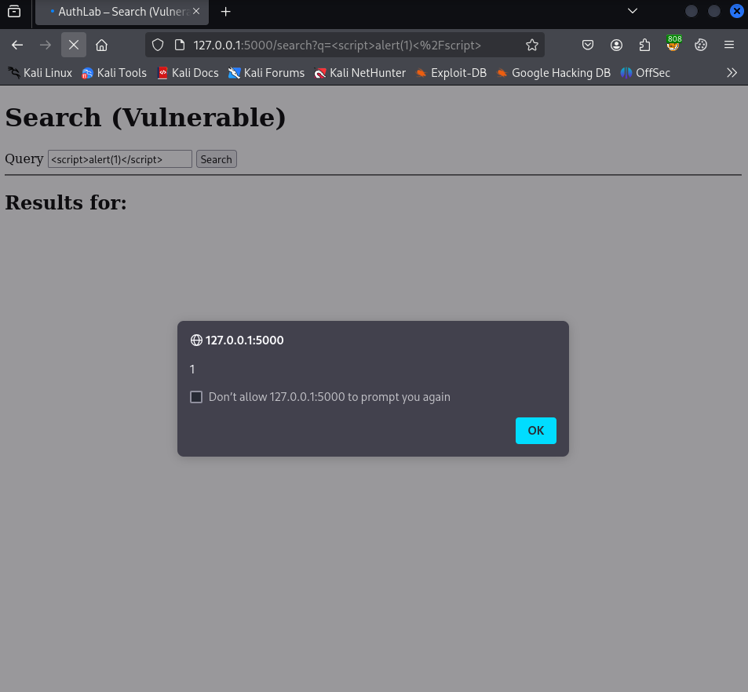
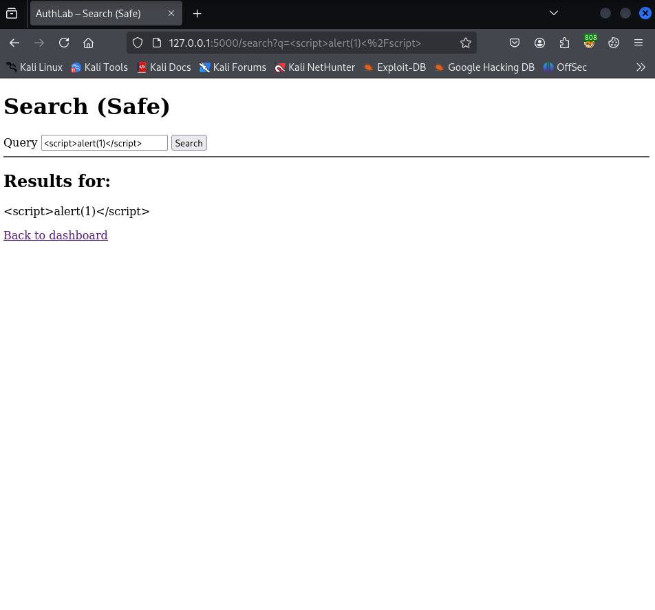

# Reflected XSS - `/search` (PoC → Fix → Verify)

* **Status:** Fixed  
* **Severity:** Medium  
* **Route:** `/search`  
* **Parameter:** `q`  
* **Environment:** Local lab (authenticated as `admin`)  
* **Toggle:** `XSS_R_STATE` env var (`poc` = vulnerable branch, `safe` = fixed branch)

---

## 1) Summary

User-controlled input from the `q` query parameter was rendered into the page without proper output encoding, enabling **Reflected Cross-Site Scripting (XSS)**.

**Impact:** arbitrary JavaScript execution in the victim’s browser (session theft, CSRF helpers, UI redressing).

---

## 2) Scope & Preconditions

* **Lab:** running locally as per [SETUP.md](../../../setup/SETUP.md) (DB seeded, app in DEV mode).
* **Client:** Firefox 128.14.0esr, local Flask dev server.  
* **Affected endpoint:** *Search* (`/search`).  
* **Reachability:** after login via `/dashboard` - link `Search (XSS)`.  
* **To reproduce PoC:** set `XSS_R_STATE=poc` in environment and restart the server.

---

## 3) Data Flow (Before)

**Source:** query string `q`  
**Sink:** HTML template (search results heading/body)

1. Browser sends `GET /search?q=<payload>`.  
2. Server reads `q` and passes it into the template.  
3. In **PoC mode**, the template renders `q` without escaping → payload executes in the browser.

---

## 4) Vulnerable Implementation (Before)

**Fragment from template [search.html](../../../../authlab/templates/search.html):**

```jinja2
<h2>Results for:</h2>

  {# Vulnerable branch: autoescape is disabled → reflected XSS #}
  {{ q }}
  {# Alternative (equally dangerous): {{ q | safe }} #}

  {# Safe branch: rely on Jinja autoescape (default) #}
  {{ q }}

```

`state` comes from `XSS_R_STATE`. In `poc` mode the block explicitly disables escaping for user-controlled `q`.

---

## 5) Proof of Concept (Before Fix)

**Precondition:** `XSS_R_STATE=poc` (restart server).

**Steps:**

1. Log in as `admin`.

2. Open:

   ```
   /search?q=<script>alert('1')</script>
   ```

3. Observe JavaScript execution (alert box).

**Screenshot:**



*Alert executes on page load.*

**Log evidence (concise excerpt)**:

```json
{"result": "xss_surface", "reason": "reflected_poc",
 "route": "/search", "meta": {"q": "<script>alert('1')</script>"}}
```

---

## 6) Fix (What Changed & Why)

**Template change:** use the **safe branch** (auto-escape on) for `q` and avoid disabling auto-escape:

```jinja2
{{ q }}
```

**Why this works:** Jinja’s default **autoescape** encodes special characters (for example `<` to `&lt;`), so the browser treats `q` as text, not executable HTML/JS.

**Principle:** OWASP XSS Prevention - **Output Encoding** for untrusted data.

---

## 7) Verification (After Fix)

**Precondition:** `XSS_R_STATE=safe` (restart server).

**Steps:**

1. Repeat the PoC payload:

   ```
   /search?q=<script>alert('1')</script>
   ```

2. **Expected:** no JavaScript execution; `<script>…</script>` appears as plain text.

**Screenshot:**



*No execution, payload rendered as text.*

**Log evidence (safe branch - concise excerpt):**

```json
{"result": "xss_surface", "reason": "reflected_safe",
 "route": "/search", "meta": {"q": "<script>alert('1')</script>"}}
```

---

### 7.5) Full log from `logs/authlab.log`

**Full log:** [full_log.jsonl](full_log.jsonl)

---

## 8) Lab Toggle Rationale (non-production)

For demonstration, the lab exposes a single environment variable (`XSS_R_STATE`) that toggles the behaviour:

* `poc`: intentionally vulnerable (no escaping for `q`)
* `safe`: encoded output (autoescape on)

