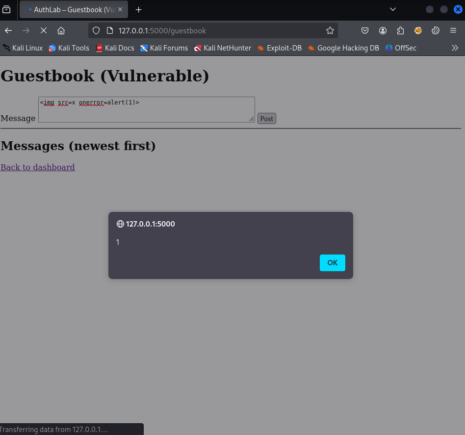
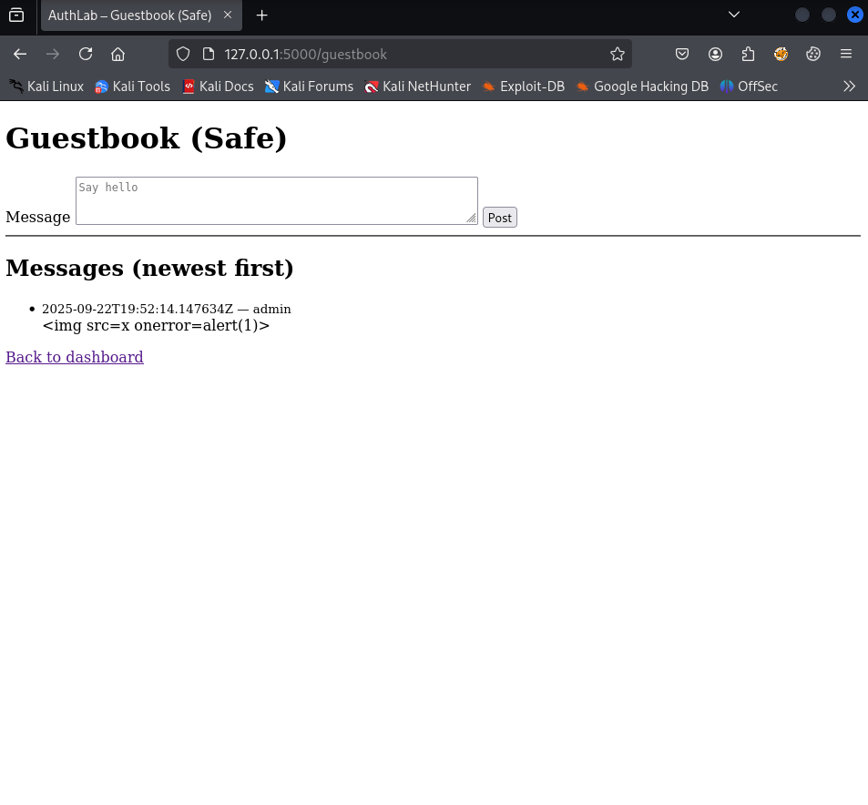

# Stored XSS - `/guestbook` (PoC → Fix → Verify)

* **Status:** Fixed  
* **Severity:** High  
* **Route:** `/guestbook` (GET, POST)  
* **Parameter:** `message`  
* **Environment:** Local lab (authenticated as `admin`)   
* **Toggle:** `XSS_R_STATE` env var (`poc` = vulnerable branch, `safe` = fixed branch)

---

## 1) Summary

User-supplied content posted to the guestbook was stored and later rendered to other users without proper output encoding. This enabled **Stored Cross-Site Scripting (XSS)**.

**Impact:** persistent arbitrary JavaScript execution in visitors’ browsers (session theft, CSRF helpers, keylogging, UI redressing).

---

## 2) Scope & Preconditions

* **Lab:** running locally as per [SETUP.md](../../../setup/SETUP.md) (DB seeded, app in DEV mode).  
* **Client:** browser (Firefox 128.14.0esr), local Flask dev server.  
* **Affected endpoint:** *Guestbook* (`/guestbook`, GET shows messages, POST adds message). 
* **Reachability:** after login via `/dashboard` - link `Guestbook (Stored XSS)`.  
* **To reproduce PoC:** set `XSS_S_STATE=poc` in environment and restart the server.

---

## 3) Data Flow (Before)

**Source:** POST body `message`  
**Storage:** in-memory list `GUESTBOOK` (raw, unfiltered)  
**Sink:** HTML template listing messages

1. User submits `POST /guestbook` with `message=<payload>`.
2. Server appends the raw `message` to `GUESTBOOK` (no sanitization or encoding).
3. Template renders each message; in **PoC mode** auto-escaping is disabled → raw HTML executes in the browser.

---

## 4) Vulnerable Implementation (Before)

**Fragment from template [guestbook.html](../../../../authlab/templates/guestbook.html):** 

```jinja2
<ul>
  
    <li>
      <small>{{ m.ts }} - {{ m.user }}</small><br>

      
        {# Vulnerable branch: autoescape is disabled - stored XSS #}
        {{ m.message }}
        {# Alternative (equally dangerous): {{ m.message | safe }} #}
      
        {# Safe branch: rely on Jinja autoescape (default) #}
        {{ m.message }}
      

    </li>
  
</ul>
```

`state` comes from `XSS_S_STATE`. In `poc` mode this block explicitly disables escaping for `m.message`, which is user-controlled.

---

## 5) Proof of Concept (Before Fix)

**Precondition:** `XSS_S_STATE=poc` (restart server).

**Steps:**

1. Log in as `admin`.

2. Open `/guestbook` and post payload:

   ```html
   
   ```

3. Refresh / revisit the page.

4. **Observed:** JavaScript execution (alert box) whenever the page is viewed.

**Screenshot:**



*Alert executing when viewing the page.*

**Log evidence (concise excerpt):**

```json
{"result": "xss_surface", "reason": "stored_poc", "route": "/guestbook","meta": {"count": 1}}
```

---

## 6) Fix (What Changed & Why)

**Template change:** we need to use the **safe branch** (auto-escape on) for `m.message` and avoid disabling auto-escape:

```jinja2
{{ m.message }}
```

**Why this works:** Jinja’s default **autoescape** encodes special characters in user-controlled text (for example `<` → `&lt;`), so the browser treats payloads as text, not executable HTML/JS.

**Principle:** OWASP XSS Prevention - **Output Encoding** for untrusted data.

---

## 7) Verification (After Fix)

**Precondition:** `XSS_S_STATE=safe` (restart server).

**Steps:**

1. Repeat the PoC payload:

   ```html
   
   ```

2. Open `/guestbook` again.

3. **Expected:** no JavaScript execution; `` is displayed as plain text.

**Screenshot:**



*No execution, payload rendered as text.*

**Log evidence (safe branch - concise excerpt):**

```json
{"result": "xss_surface", "reason": "stored_safe", "route": "/guestbook", "meta": {"count": 1}}
```

---

### 7.5) Full log from `logs/authlab.log`

**Full log:** [full_log.jsonl](full_log.jsonl)

---

## 8) Lab Toggle Rationale (non-production)

For demonstration, the lab exposes a single environment variable (`XSS_S_STATE`) that toggles the behaviour:

* `poc`: intentionally vulnerable (no escaping for `m.message`)
* `safe`: encoded output (autoescape on)